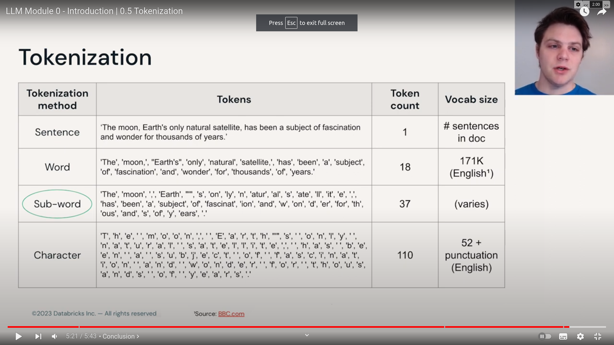

## Tokenization



transforming test into word sized pieces.

> Word tokenization :

- Simple approach is to 

1. know all the words in the vocabulary and then have an index associated to it. 
```
    a : 0
    the : 1
    moon : 2
    ...
    ...
    if : 514
    ...

```
2. map the words from the input using this vocabulary index map to sequence of index
```
input : the moon is round in shape

tokenized : {
    the : 1
    moon : 2,
    is: 4
    round: 312,
    in: 90,
    shape:1223
}...

the moon is round in shape -> [1,2,4,312, 90, 1223]

```

Pros :

1. its simple

Cons : 
1. big vocabulary => high storage
2. complications like mis-spelled word or out of vocabulary words => some error handling for them.


> Chracter tokenization :

- Simple approach remain same as the word tokenization

```
a:1
b:2
c:3
...
z:26


a : [1]
the: [20,8,5]
moon : [....]... for other words 
the mapping becomes quite large.
```
Pros : 

1. small vocabulary
2. no out of vocabulary words

Cons :

1. Loss of meaning or context we derive or get form word.
2. much much longer sequence for same sequence.

> tokenization : sub-words

- this vocabulary is made from words that co-occur frequently
- more robust to novel words.

1. Build index : "dictionary of tokens (mix of sub-words or words)"
   1. Byte pair encoding (BPE) is popular encoding.
2. map tokens to indices.

