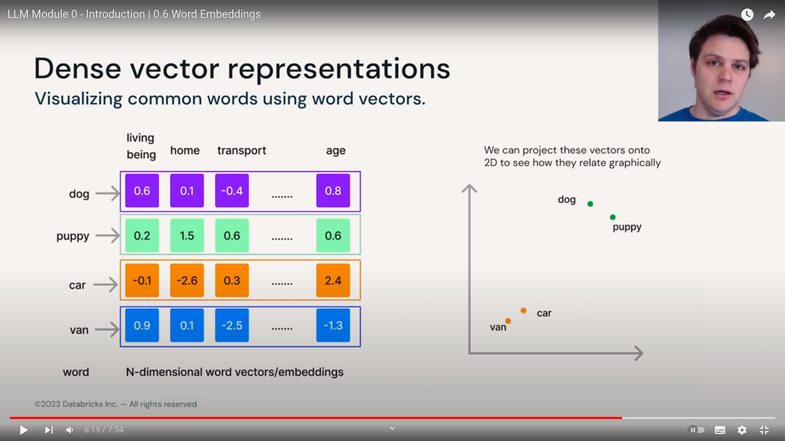

## Word Embedding

- The primary goal of the word embedding it to preserve the context it have in context.
- This context can be its relation to other words OR the intrinsic meaning the word have.

Words with similar meaning tend to occur in similar contexts
example : 

1. The cat meowed at me for food.
2. The  kitten meowed at me for treats.

The words `cat` and `kitten` share context similar to `food` and `treats`.

- If we use vectors to encode tokens we can attempt to store the meaning.
  - Vectors are basic input to many ML methods.
  - Tokens that are similar in meaning can be positioned as neighbours in the vector space using right mapping functions.

## How to convert words to vectors ?

Document :              |    the | cat | sat | in | hat | with |
the cat sat             :     1  |  1  |  1  | 0  |  0  |  0   |
the cat sat in the hat  :     2  |  1  |  1  | 1  |  1  |  0   |
the cat with the hat    :     2  |  1  |  0  | 0  |  1  |  1   |

we now have 6 length vector.

- If we have to find which 2 sentences are "similar" we can see the `count matrix` suggest the "last 2 are similar".
- In this approach the `big limitation` is the `sparsity`. in a normal document or file, yu wont find all the words of a vocubulary getting used.

## Creating dense vector representations :

- idea is to give each word a vector representation and use data to build our embedding space.

puppy --> EmbeddingFunction() --> WordEmbeddingVector (example [0.2, 1.5, 0.6.. 0.8])

The embedding function is a pretrained module(example word2vec)