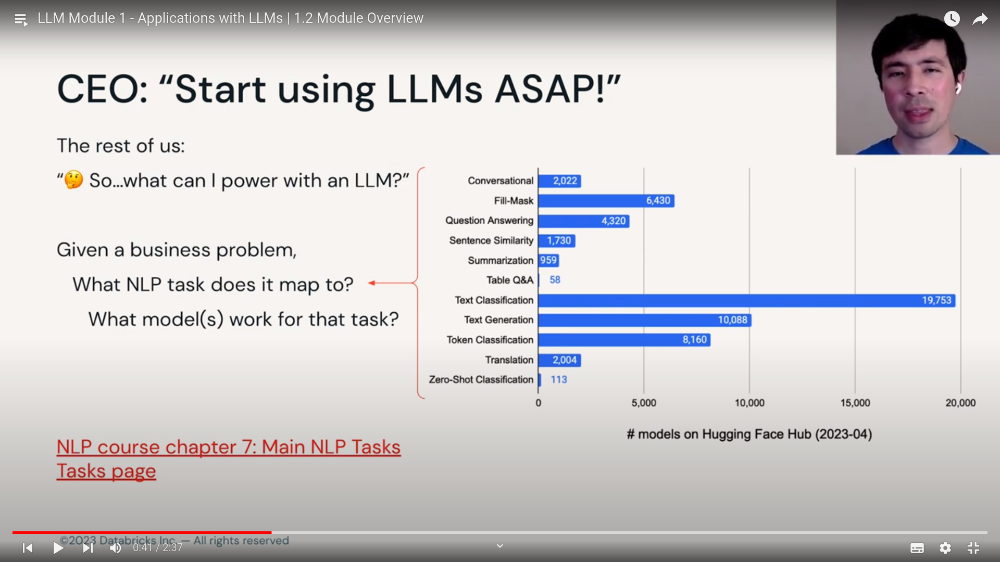
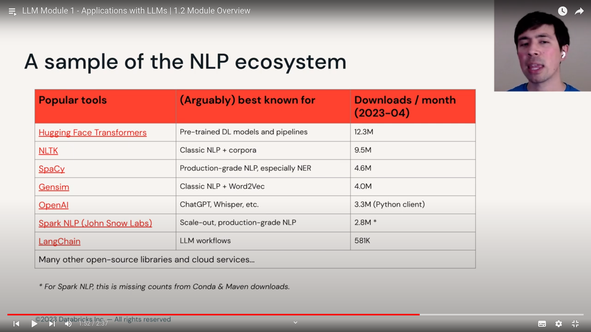

## Learning Objectives

By the end of the module, you will understand :

1. Breadth of applications that pre-trained LLMs solve.
2. Download and interact with LLMs via hugging face datasets, pipelines, tokenizers, models.
3. understand how to find good model for your application, including via hugging face hub
4. understand the importance of prompt engineering.

> CEO : `Start using LLMs ASAP!!!`

the rest of us : `what can i power with LLMs ?`

- given a business problem, wat NLP task does it map to ?
- what model work for that task ? there are 1000's of models for some task and we have to pick, that's cumbersome too.

## Sample of NLP Ecosystem :

note : 
- hugging face offers a lot more models => more downloads
- classical nlp libraries/models are probably not all LLM or deep learning based.
- lang chain or some are not LLM directly, more of worflow or way of combining multiple LLMs

