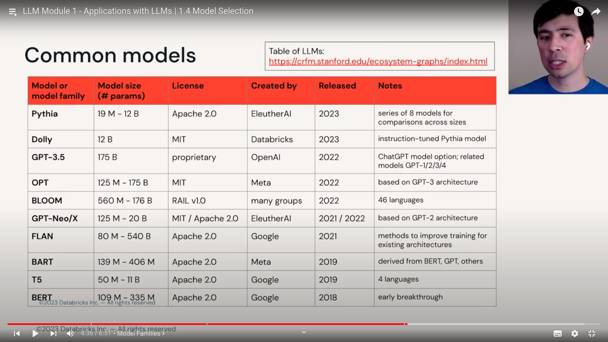

## how to select model

`CNN : A magnitude 6.7 earthquake rattled papua new guinea ...` ===> Article summary

NLP task behind the above : `Summarization`

- `Extractive` : Select representative pieces of text
- `Abstractive` : generate new text

here is `extractive`, on hugging face you have say +176620 models

After filtering by task, we get ~+1000 models

what to do after that ???

selecting a model : filtering and sorting

- selecting a model with permissive licence, a clear cut filter.
- selecting for certain language like spanish or japnese etc.. again a clear cut

- filter by model size, (or limits on hardware, cost, latency, performance etc...)
- filter by adoption or documentation etc...
- sort by popularity, download counts, 
- filter or sort by how old it is or how recently updated it is etc... (it may not load with modern versions)
- understanding any benchmarks or relevant info published by folks.

> Once you get to few models, you still will have lots of variants to choose among the models.

- variants are size based like small, base, large, very large etc... 
- fine tuned variants.

- consider the examples, datasets, models

- Ask if the model is good for everything or is it fine-tuned for specific tasks.
- which datasets were used for pre-training or fine-tuning.

> Ultimately its about your users and tyour data

- Define the KPIs
- Test on your data.

> Remember and recoganise the good models and model families.

some good models

