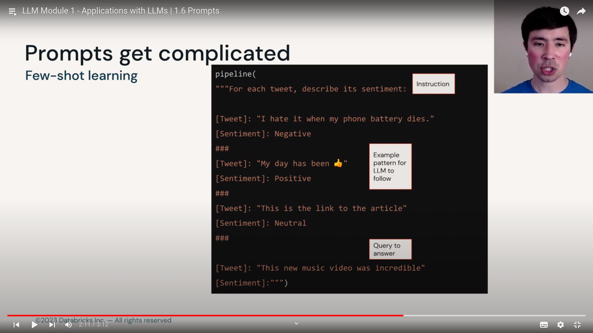
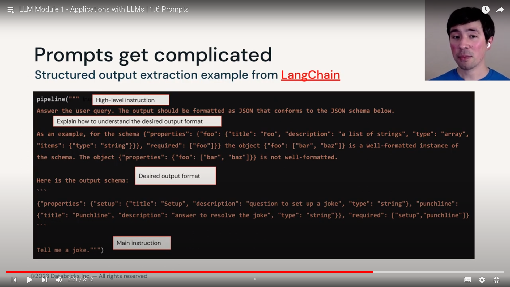

## Prompts :

These appear in Instruction following flexible and interactive LLMs

`Prompts` : Inputs or Queries to LLMs to elicit responses.

> Foundation Models :

- Trained on text generation tasks like predicting the next set of token sequence.
  - Dear reader, Let us offer our heartfelt `apology for what we wrote last week in the article entitled ...`
- OR filling missing tokens in sequence.
  - Dear reader, et us offer our heartfelt `apology for what we wrote last week` in the article entitled ...

> Instruction Models

- tuned to follow arbitrary instructions OR prompts

- prompt : give me 3 ideas for cookies
- prompt : write a short story about a dog, hat and cellphone
  - brownie was a good dog, he had a habit of chewing on cellphones, he was sitting behind having some hat on top of his head...

## structure or promtps :

- prompts can be sentences or questions
- it can be a code snippet or commands
- combination of above
- emojis
- basically any text!!!

**Prompts can include output of other LLMs queries, this allows nesting or chaining LLMs, creating possibly complex or dynamic interactions**

