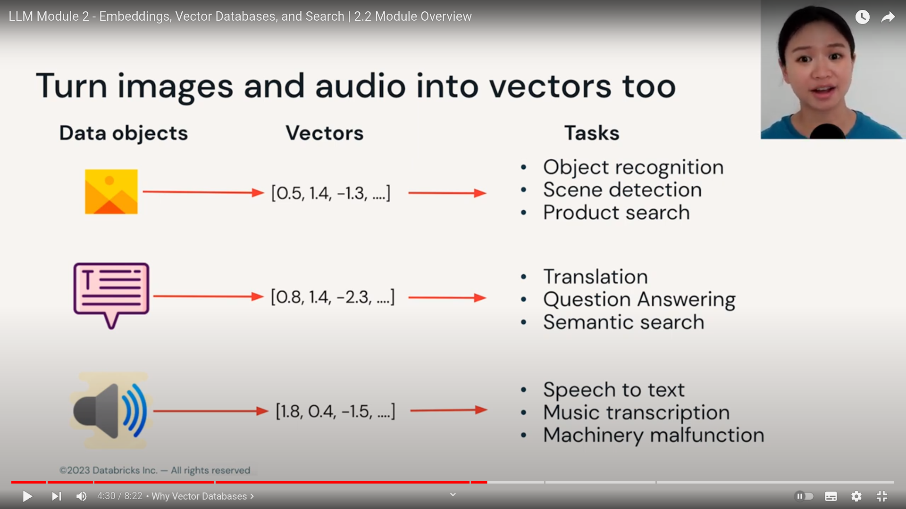

## Overview : Embeddgings Vector Databases Search

> Learning Objectives :

Understand vector search strategies and how to evaluate search results.

Understand utility of vector databases

Differentiate between vector databases, vector libraries and vector plugins.

Learn best practices for when to use vector stores and how to improve search retrieval performance.

## How do models learn knowledge

1. through model training OR fine-tuning
   1. Via model weights

2. Through model inputs
   1. Insert knowledge or context in the inputs(prompts)
   2. Aks LM to incorporate the context in its output.

## Passing context to LMs helps in factual recalls.
- fine tuning is helpful for a specific task example studying for an exam that is 2 weeks away.
- Analogy is : taking exam with open book.
- there are limitations or downsides :
  - `context length limitation.`
    - example chatgpt-3.5-turbo could take max 4K tokens(5 pages) as context.
    - Anthropic claude : 100k tokens max
  - `Longer context => higher API cost and higher processing time.`

## vector databases

- `data` can be image, text, audio, vedio
- all converted to vector embeddings
- Tasks :
  - object recognition
  - scene detection
  - product search
  - translation
  - Quesiton answering
  - Sementic search
  - speech to text
  - music transcription
  - machinery malfunction

> uses of vector databases :

1. Similarity search : text, vedio, image, audio.
   1. de-duplication
   2. sementic match rather than keyword match! => enhancing product search.
   3. very useful for knowledge based Q/A.
2. Recommendation engines
   1. Example blog post : spotify uses vector search to recommend podcast episodes.
3. finding security threats
   1. vectorizing virus binaries and finding anomalies. 

> Search and Retrieval-Augmented Generation

`RAG Workflow`

A knowledge base question answering system have two aspects : `search` and `retrieval`.

It also have a base that you have some knowledge in the system.

1st : we convert our knowledge to embedding vectors.
2nd : we store these vectors in the vector database or index/library.
3rd : we can ask users to run queries on this. convert them to embedding vectors and use it for search over hte vector database.
4th : result context is generated depending on similarity and search result of vector database.
5th : this context can pass through the LMs and it understand the context and gives the user the relevant output. (LM with context)
