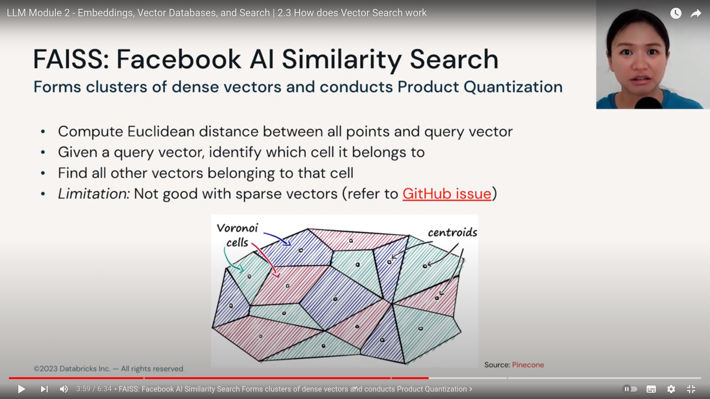
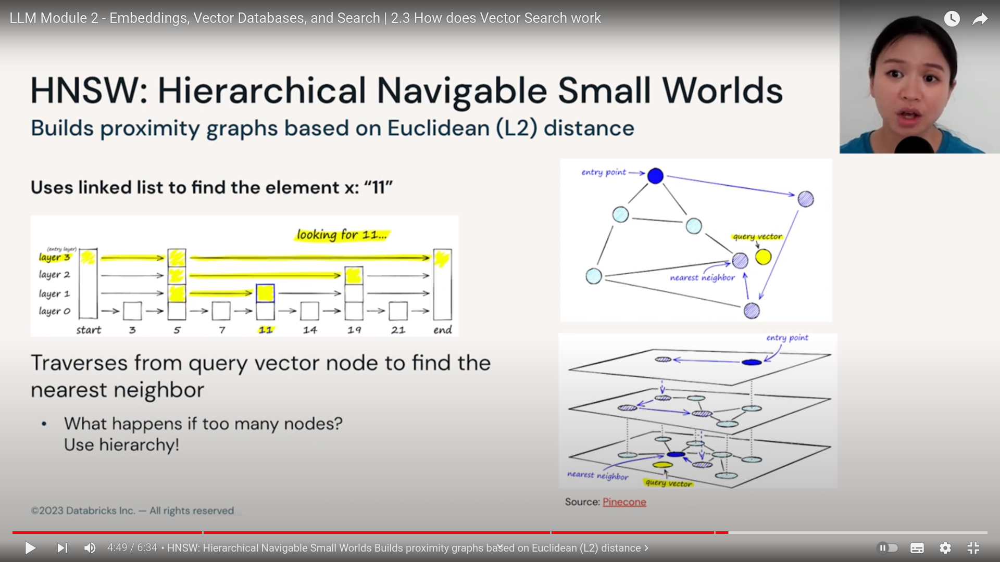

## How do search vector work

`Vector Search Strategies`

- K-NN : K nearest neighbours
- Approximate nearest neighbours (ANN)
  - trade accuracy for speed
  - Examples of indexing algorithms :
    - Tree based : ANNOY by spotify
    - Proximity Graph : HNSW  `* Popular`
    - Clustering : FAISS by Facebook `* Popular`
    - Hashing : LSH
    - sCaNN by Google

### How to measure if 2 vectors are similar

1. Distance metric : manhattan distance(L1 distance) OR ecludian distance (L2 distance)
2. Similarity metric : cosine value

### Compressing vectors with Product Quantization

`PQ (Product Quantization)` stores vectors with fewer bytes.

`Quantization` = representing vectos into smaller set of vectors.
    - example (naive one) : 8.94959132 ~= 9
  
`Tradeoff between recall and memory`

Original vector : D dimension vector [--------------------------------]

dimension remain same

split into n sub vectors : D dimension vectors [---] [---] [---] [---] [---] [---] ...

replace vector values and assign a centroid ID : for each sub vector, you can assign a average or sorts to represent the entire vector.

**Ability to search for "similar" objects is awesome, it is not limited to fuzzy text OR exact matching rules**

## FAISS : Facebook AI Similarity Search

## HNSW : Hierarchical Navigable Small Worlds

